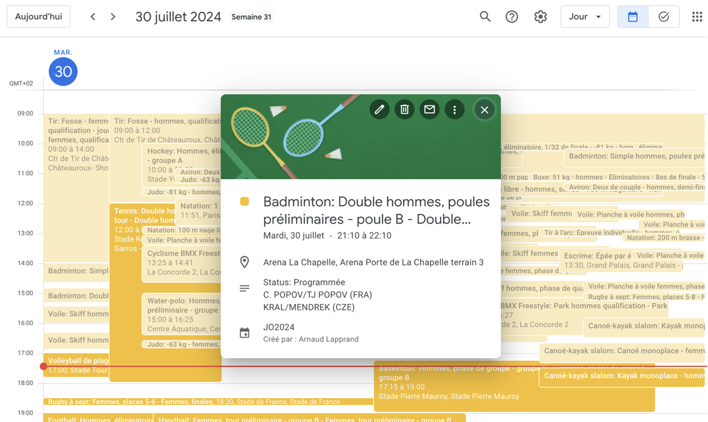

# JO2024 ICS Builder

This script allows you to create an ICS file containing the schedule of events for the 2024 Olympic Games in Paris, France. The ICS file can be imported into a calendar application to view the schedule of events.

## Illustration



## Usage

To use the script, you'll need to have Python 3 installed on your system. You can then install the required dependencies by running the following command:

```sh
pip install -r requirements.txt
```

Once you have the required dependencies installed, you can run the script by executing the following command:

```sh
python jo2024_ics_builder.py
```

By default, the script will create an ICS file containing the schedule of events for July 30, 2024. You can specify a different date or date range by modifying the `start_date` and `end_date` variables at the bottom of the script.

The ICS file will be saved in the `output` folder, with a filename that includes the start and end dates of the date range you specified. For example, if you specify a date range of July 30 to August 10, 2024, the filename will be `JO2024-07-30-to-08-10.ics`.

After having the file you will then be able to import the events into your favorite calendar app.

## Data Source

The script retrieves the schedule of events from the following API endpoint:

```bash
https://sph-s-api.olympics.com/summer/schedules/api/{lang}/schedule/day/{date_str}
``` 

where `{date_str}` is the date for which you want to retrieve the schedule of events, in the format `YYYY-MM-DD`.

## Filters

The script allows you to filter the events based on nations and sports. You can specify a list of nations and sports that you are interested in. The script will include only the events that match the specified filters.

### Example

```python
lang = 'FRA'  # 'ENG' <-- If you want events in English (final ICS)
start_date = datetime(2024, 7, 30)
end_date = datetime(2024, 8, 10)  # Optional - if not set, will match the start date (entire day)
nations = ['FRA']  # Optional
sports = ['Badminton', 'Tennis', 'BMX', 'Skate', 'Gym', 'Table Tennis', 'Judo', 'Fencing']  # Optional

# Main entry point
create_ics(lang=lang, start_date=start_date, end_date=end_date, nations=nations, sports=sports)
```

> NB : Sports are processed with the values provided. Match in lower case from `/assets/sports-codes.json` full name. Then the process is filtering on sports code.

## Dependencies

The script requires the following Python packages:

    ics: A library for working with iCalendar (ICS) files.
    requests: A library for making HTTP requests.


## License

This script is licensed under the MIT License. See the LICENSE file for more information.

## Contributing

Contributions are welcome! Please open an issue or submit a pull request if you have any suggestions or improvements.

## Acknowledgments

This script was created to help users easily generate ICS files for the 2024 Olympic Games schedule.